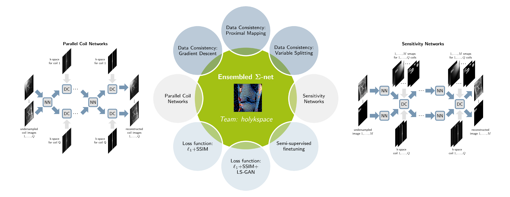

# Sigmanet

*Systematic Evaluation of Iterative Deep Neural Networks for Fast Parallel MR Image Reconstruction*

### Contact
-   Kerstin Hammernik (k.hammernik@imperial.ac.uk)
-   Jo Schlemper (jschlemper@hyperfine-research.com)
-   Chen Qin (c.qin15@imperial.ac.uk)
-   Jinming Duan (j.duan@bham.ac.uk)
  
## What is Sigmanet?

<div><div align="left">

</div>

The first [fastMRI challenge](https://fastmri.org) provided a great opportunity to push the limits of MRI data acquisition speed further using deep learning. Instead of using a single _best_ model, we investigate several network architectures for multicoil MR image reconstruction, defined in a sigmanet, including _sensitivity networks_ and _parallel coil networks_, various data consistency layers, regularization networks and (semi-)supervised learning schemes. *Sigmanet* by our team _holykspace_ is among the top-three entries in the [public](https://fastmri.org/leaderboards) and [challenge](https://fastmri.org/leaderboards/challenge) leaderboard for multicoil MR image reconstruction (December 2019). 

Our framework allows for a systematic evaluation of various iterative deep neural networks for image enhancement and image reconstruction. This repository builds upon the [fastMRI source code](https://github.com/facebookresearch/fastMRI) and contains code for data processing, training, testing and evaluation for the [fastMRI dataset](https://fastmri.org/) used in our publications
 - Hammernik et al., [*Sigmanet: Systematic Evaluation of Iterative Deep Neural Networks for Fast Parallel MR Image Reconstruction*](http://arxiv.org/abs/1912.09278), arXiv preprint arXiv:1912.09278, 2019.
 - Schlemper et al., [*Sigmanet: Ensembled Iterative Deep Neural Networks for Accelerated Parallel MR Image Reconstruction*](http://arxiv.org/abs/1912.05480), arXiv preprint arXiv:1912.05480, 2019. 

If you use this code for your research please cite

```
@article{hammernik2019sigmanet,
    author = {Hammernik Kerstin and Schlemper Jo and Qin Chen and Duan Jingming and Summers Ronald M. and Rueckert Daniel},
    title = {$\Sigma$-net {Systematic Evaluation of Iterative Deep Neural Networks for Fast Parallel MR Image Reconstruction}},
    journal = {arXiv preprint arXiv:1912.09278},
    year = {2019},
    archivePrefix={arXiv},
    eprint={1912.09278},
}
```
## Structure of the repository

- sigmanet (ROOT)
  - data_processing
  - ipynb
  - reconstruction (based on the [fastMRI source code](https://github.com/facebookresearch/fastMRI))
    - common
    - data
    - models

## Requirements

1. Setting up an environment following the [fastMRI](https://github.com/facebookresearch/fastMRI) repository
2. [BART toolbox](https://github.com/mrirecon/bart) for coil sensitivity map estimation using [ESPIRiT](https://onlinelibrary.wiley.com/doi/full/10.1002/mrm.24751).
3. [medutils](https://github.com/khammernik/medutils)

## Data Processing
1. It might be easiest to setup an environment variable `${FASTMRI}` pointing to the fastMRI data root directory. We suggest following structure for the data
   - `${FASTMRI}`
     - data
       - multicoil_train
       - multicoil_val
       - multicoil_test_v2
     - datasets
2. Creation of `*.csv` files with meta information about the datasets by running

   ```python data_processing/create_dataset_csv.py --csv-path ${FASTMRI}/datasets --data-path ${FASTMRI}/data --dataset multicoil_train```

    We provide a jupyter notebook in `ipynb/csv_stats.ipynb` to get some statistics of the datasets.

3. Estimation of coil sensitivity maps using [ESPIRiT](https://onlinelibrary.wiley.com/doi/full/10.1002/mrm.24751) by running the file
   
   ``` python data_processing/estimate_sensitivities.py --csv-path ${FASTMRI}/datasets --data-path ${FASTMRI}/data --dataset multicoil_train --acl 15 30```

   This requires a proper setup of the [BART toolbox](https://github.com/mrirecon/bart). The flag `--acl` specifies the number of low frequencies / auto-calibration lines for which the sensitivity maps should be computed and is only used for the train and validation dataset. For the test and challenge dataset, we use the provided number of low frequencies for sensitivity map estimation. For more details on the `*.h5` files, we refer to our [article](http://arxiv.org/abs/1912.09278) and to the source code. The data is stored with an additional suffix `_espirit` in the datafolder.

4. (optional) However, in many cases reading the `*.h5` data is extremely slow. To reduce the dataset and improve the dataloading, we recommend running

    ``` python data_processing/copy_data_to_local.py  --csv-path ${FASTMRI}/datasets --data-path ${FASTMRI}/data --out-path ${FASTMRI}/data_reduced --dataset multicoil_train```

    This crops the dataset in Frequency Encoding (FE) direction without introducing new artifacts. If an additional `--float16` flag is provided, data are stored as float16 which additionally reduces memory. If resources allow, try to copy as much data as you can to your local disk to further speed-up data loading.

5. (optional) For training and testing, we used foreground masks which we store for the individual datasets with the suffix `_foreground` in the datafolder. We provide the foreground masks for the knee dataset upon request.

**Note:** The data processing works for both the fastMRI knee and brain dataset. The number of ACL lines for training and testing was fixed for the knee dataset to 15 for R=8 and 30 for R=4 by examining the numbers of ACL lines given in the test dataset. A different setting might be chosen for the brain dataset.

## Sensitivity-weighted target as reference
Once the datasets are setup and sensitivity maps are estimated, the new sensitivity-weighted target for the evaulation on the validation set can be computed using

```  python data_processing/create_sense_target.py --data-path=${FASTMRI}/data --csv-path=${FASTMRI}/datasets --dataset=multicoil_val --acl 15 30 --acceleration 8 4 --out-path ${FASTMRI}/results/sense_target ```

If additionally the flag `--mask-bg` is provided, the background regions are masked out. Therefore, foreground masks are necessary, see previous section / 5. This is only used for final evaluation and not during training.

## Zero-filling reconstruction
To make a first test of the implementation, we encourage to run the zero-filled reconstruction from `reconstruction/models/zero_filled_sense/`
``` 
CUDA_VISIBLE_DEVICES=0 python run_zero_filled_sense.py --challenge multicoil --data-path ${FASTMRI}/data --csv-path ${FASTMRI}/datasets --data-split val --out-dir ${FASTMRI}/results/zf/R8 --acceleration 8 --center-fractions 0.04
```

## Training
All networks can be run from the directory `reconstruction/models/sigmanet`. An example training to train a sensitivity network can be started as follows.

```  CUDA_VISIBLE_DEVICES=0 python train.py --challenge multicoil --data-path ${FASTMRI}/data --csv-path ${FASTMRI}/datasets --exp-dir ${FASTMRI}/trained_models/sn --num-iter 8 --data-term PROX --regularization-term dunet --batch-size 1 --num-epochs 40 --fe-patch-size 96 --optimizer rmsprop --lr 1e-4  --use-fg-mask --lambda-init 10 --learn-data-term --shared ```

- `--use-fg-mask` uses pre-computed foreground masks for training
- `--data-term` can be `NONE`, `GD`, `PROX`, `VS`
- `--lambda-init` defines the initialization of the dataterm weight. This is crucial for the learning behaviour.
- `--learn-data-term` Learns the dataterm weight during training
- `--shared` denotes shared parameters over the number of cascades defined via `--num-iter`
- `--regularization` can be `dunet` or `unet`

A detailed description of the flags can be found in the source code.

**Note:** The training and testing code was originally designed for the knee dataset with fixed base resolution of (320 x 320) and might not fully support the brain dataset yet. 

## Testing
Testing of sigmanet networks can be conducted in the directory `reconstruction/models/sigmanet`. To run a trained model you can use following command

``` CUDA_VISIBLE_DEVICES=0 python run.py --challenge multicoil --data-split val --data-path ${FASTMRI}/data --csv-path ${FASTMRI}/datasets --out-dir ${FASTMRI}/results/sn --checkpoint ${FASTMRI}/trained_models/sn/model.pt --accelerations 4 --center-fractions 0.08 --mask-bg ```

The flag `--mask-bg` applies the foreground mask (if available).

## Evaluation
The evaluation script of fastMRI is extended to work with sensitivity-weighted targets. For evaluation, you can use following command from the root directory of this repository.

``` python reconstruction/common/evaluate.py --challenge=multicoil --sense-target --dataset knee --target-path=<sense-target-path> --predictions-path=<prediction-path> ```

The flag `--sense-target` indicates that the sensitivity-combined targets are used which are stored with the key `reconstruction_sense` when creating the new targets as described above. The evaluation script also works for root-sum-of-squares (RSS) targets as in the original version by removing the `--sense-target` flag.

## License

Sigmanet is MIT licensed, see LICENSE file.

Sigmanet builds upon the [fastMRI source code](https://github.com/facebookresearch/fastMRI), which is also MIT licensed.